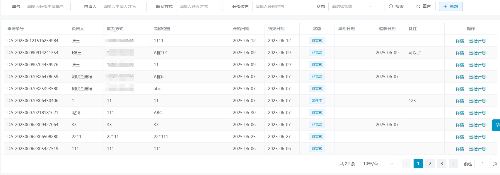

# 数字园区管理系统V3.1

#### 介绍
数字园区管理平台通过Web端、员工端和用户端实现全方位的数字化管理。Web端作为运营管理的核心，提供系统管理、资讯与通知公告管理、招商、物业、访客、装修、报障报修、任务工单、客服、合同、财务、数据统计、模板管理和可视化大屏等功能，支持园区高效运营和决策。员工端通过微信小程序支持任务工单处理、巡检任务执行和信息管理，提升工作效率。用户端同样通过小程序提供登录绑定、园区资讯查看、物业出租查询、访客预约、装修申请、报障报修、合同查看、投诉建议、账单支付、发票申请和个人信息管理等功能，增强用户体验。整体平台通过多端协同，实现园区管理的智能化、便捷化和高效化。()
(AI服务 正在开发中)

#### 软件架构
* 核心框架：Spring Boot 3
* 前端： Vue3
* 关系型数据库: Mysql 8.0
* 数据库连接池：Druid 1.2.3
* 缓存数据库: Redis 4.0.9
* 项目管理工具: Maven 3.3+
* 小程序：uniapp

### 体验地址
小程序体验地址
 

### 后端体验地址
联系方式（技术支持）
 

### 加入我们

交流群
 

# 功能点

## 一、Web运营管理平台端

### 1. 系统管理
提供账号、部门、角色和权限的配置功能，支持系统日志记录，确保系统安全性和操作规范性。管理员可创建、管理账号，分配角色权限，维护部门架构，保障平台稳定运行。

### 2. 资讯管理
负责园区资讯的发布与管理，支持图文展示、内容分类和标签功能。管理员可创建、审核和发布资讯，增强信息透明度和用户粘性。

### 3. 通知公告管理
用于发布和管理园区通知公告，支持消息推送和内容审核。管理员可设置发布范围和时间，确保信息准确传达，提升管理效率。

### 4. 招商管理
管理房源和车位信息，支持状态更新、租赁登记和租金约定。管理员可发布租赁信息，管理咨询申请，跟踪进度，优化资源分配。

### 5. 物业管理
涵盖房源、车位、场地等物业资源的全面管理，支持租户信息管理和场地预订审批，确保资源合理使用。

### 6. 访客管理
处理访客预约、审批及到访记录，支持访客黑白名单管理，维护园区安全和秩序，提升管理效率。

### 7. 装修管理
负责装修申请审批、记录查看及验收，支持押金缴纳状态查看及退费操作，规范装修流程。

### 8. 报障报修管理
处理用户报障报修需求，支持报障记录查看、任务工单创建和报障类型管理，提升服务质量。

### 9. 任务工单管理
支持任务工单的创建、指派、处理和统计，提升工作效率和服务质量。

### 10. 合同管理
管理合同记录，支持新建、变更、续签和临期提醒，实现合同管理的规范化和信息化。

### 11. 财务管理
涵盖计费管理、对账账单、报账凭证、发票管理和支付管理，实现财务流程的自动化和信息化。

### 12. AI服务
围绕AI企业服务，生成不同的AI-agent

## 二、微信小程序端（员工侧）

### 1. 任务工单
支持员工查看、领取、处理任务工单，记录处理过程，提升工作效率和服务质量。

### 2. 个人中心
支持员工管理个人基础信息，查看工作任务统计和历史记录，方便了解工作情况。

## 三、微信小程序端（用户侧）

### 1. 登录与绑定
支持用户通过微信号登录，确保身份唯一性和安全性，提供便捷的园区服务入口。

### 2. 园区资讯与通知公告
支持用户查看园区资讯和通知公告，及时了解最新动态，增强信息交流。

### 3. 物业出租
支持用户查看房源和车位招租信息，提交租赁咨询申请，提升租赁服务体验。

### 4. 访客预约
支持用户填写访客信息并提交来访申请，提升园区访客管理的安全性和效率。

### 5. 装修申请
支持用户填写装修申请信息并提交审批，查看押金缴纳状态，规范装修流程。

### 6. 报障报修
支持用户提交报障报修单，查看处理进度和结果，提升维修服务体验。

### 7. 我的合同
支持用户查看合同信息及电子版附件，提供便捷的合同管理渠道。

### 8. 投诉建议
支持用户提交投诉建议，查看处理进度和回复内容，提升园区服务质量。

### 9. 我的账单
支持用户查看历史账单记录，通过微信支付缴费，接收缴费通知。

### 10. 我的发票
支持用户填写发票申请信息，查看申请历史记录并下载发票附件。

### 11. 个人中心
支持用户管理个人基础信息和企业信息，查看历史租赁信息，提供便捷的信息管理渠道。

## 演示图

*PC端后台管理
<table>
    <tr>
        <td></td>
        <td></td>
    </tr>
    <tr>
        <td></td>
        <td></td>
    </tr>
	    <tr>
        <td></td>
    </tr>
</table>

*微信小程序端
 

&nbsp;&nbsp;&nbsp;&nbsp;&nbsp;&nbsp;&nbsp;&nbsp;&nbsp;&nbsp;

&nbsp;&nbsp;&nbsp;&nbsp;&nbsp;&nbsp;&nbsp;&nbsp;&nbsp;&nbsp;

&nbsp;&nbsp;&nbsp;&nbsp;&nbsp;&nbsp;&nbsp;&nbsp;&nbsp;&nbsp;

&nbsp;&nbsp;&nbsp;&nbsp;&nbsp;&nbsp;&nbsp;&nbsp;&nbsp;&nbsp;

 